## Programming for a more convenient life

 &hide=jupyter%20notebook)  

<!-- idk why but github camo won't refresh if I use the style below. even if `curl -X PURGE https://camo.githubusercontent.com/...` -->

<!-- <picture>
  <source
    srcset="https://github-readme-stats-eta-six-47.vercel.app/api?username=YuevUwU&show_icons=true&theme=midnight-purple&hide_border=true&border_radius=10&show=reviews"
    media="(prefers-color-scheme: dark)"
  />
  <source
    srcset="https://github-readme-stats-eta-six-47.vercel.app/api?username=YuevUwU&show_icons=true&theme=buefy&hide_border=true&border_radius=10&show=reviews"
    media="(prefers-color-scheme: light), (prefers-color-scheme: no-preference)"
  />
  
</picture> -->

<!-- <picture>
  <source
    srcset="https://github-readme-stats-eta-six-47.vercel.app/api/top-langs/?username=YuevUwU&layout=donut&theme=midnight-purple&hide_border=true&border_radius=10&size_weight=1&count_weight=0&exclude_repo=Circuit-Miscellaneous-Fabric,DirtToolsMod-Fabric,EnchantedBookSplitter&custom_title=Most Used Languages (GitHub)"
    media="(prefers-color-scheme: dark)"
  />
  <source
    srcset="https://github-readme-stats-eta-six-47.vercel.app/api/top-langs/?username=YuevUwU&layout=donut&theme=buefy&hide_border=true&border_radius=10&size_weight=1&count_weight=0&exclude_repo=Circuit-Miscellaneous-Fabric,DirtToolsMod-Fabric,EnchantedBookSplitter&custom_title=Most Used Languages (GitHub)"
    media="(prefers-color-scheme: light), (prefers-color-scheme: no-preference)"
  />
  
</picture> -->

<!-- <picture>
  <source
    srcset="https://github-readme-stats-eta-six-47.vercel.app/api/wakatime/?username=YuevUwU&layout=compact&theme=midnight-purple&hide_border=true&border_radius=10&size_weight=1&count_weight=0&langs_count=12&hide=other,yaml,json,toml,text,markdown"
    media="(prefers-color-scheme: dark)"
  />
  <source
    srcset="https://github-readme-stats-eta-six-47.vercel.app/api/wakatime/?username=YuevUwU&layout=compact&theme=buefy&hide_border=true&border_radius=10&size_weight=1&count_weight=0&langs_count=12&hide=other,yaml,json,toml,text,markdown"
    media="(prefers-color-scheme: light), (prefers-color-scheme: no-preference)"
  />
  
</picture> -->

